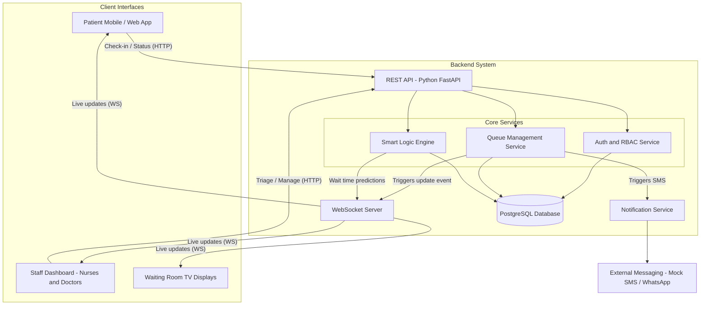

# Backend Architecture — Digital Queue Management System

How client applications interact with the Smart Logic Engine and the backend services.
The full original document (with the ERD and the dual-track flowchart) is in
[backend_architecture_and_erd.pdf](backend_architecture_and_erd.pdf).

## Architecture diagram

## Components

- **REST API (Python / FastAPI)** — standard request/response actions: patient
  check-in, nurse triage submissions, status updates. Business logic lives here,
  never in the clients.
- **WebSocket Server** — keeps open connections to patient phones, staff
  dashboards and waiting-room TVs, and pushes queue changes instantly instead of
  the clients polling.
- **Smart Logic Engine** — the core algorithm: dual-track (Urgent / Routine)
  sorting, wait-time prediction, emergency insertion and starvation protection.
- **Auth & RBAC Service** — staff login and role checks (Admin, Nurse, Doctor).
- **Notification Service** — one place that sends patient notifications. Mock
  SMS/WhatsApp during development, swappable for a real provider later.
- **PostgreSQL** — stores all data. Clients never talk to it directly.

## As built right now (so the diagram is not misread)

The diagram is the target design. The current code differs in two ways:

- The WebSocket endpoint currently lives *inside* the FastAPI app at `/ws`
  (one process), not as a separate server yet.
- Auth/RBAC and the Notification Service are not implemented yet — endpoints
  are open for testing and take a `staff_id` in the request body.
